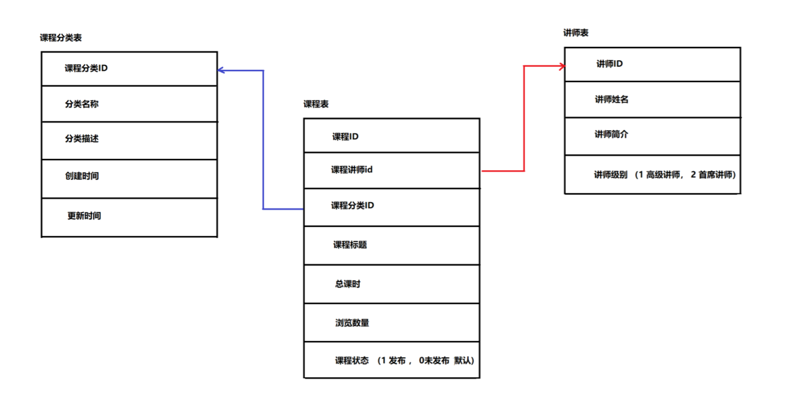

## SQL题1

### 数据准备

```mysql
#创建数据库 lianxi01
create database lianxi01 character set utf8;

#使用数据库
use lianxi01;

#创建商品表：
CREATE TABLE product(
	pid INT,#主键ID
	pname VARCHAR(20),#商品名称
	price DOUBLE,#商品价格
	category_name VARCHAR(32)#商品分类名称
);

#导入数据
INSERT INTO product(pid,pname,price,category_name) VALUES(1,'联想电脑',5000,'电脑办公');
INSERT INTO product(pid,pname,price,category_name) VALUES(2,'海尔电脑',3000,'电脑办公');
INSERT INTO product(pid,pname,price,category_name) VALUES(3,'雷神电脑',5000,'电脑办公');

INSERT INTO product(pid,pname,price,category_name) VALUES(4,'JACK JONES',800,'服装');
INSERT INTO product(pid,pname,price,category_name) VALUES(5,'真维斯',200,'服装');
INSERT INTO product(pid,pname,price,category_name) VALUES(6,'花花公子',440,'服装');
INSERT INTO product(pid,pname,price,category_name) VALUES(7,'劲霸',2000,'服装');

INSERT INTO product(pid,pname,price,category_name) VALUES(8,'香奈儿',800,'女士用品');
INSERT INTO product(pid,pname,price,category_name) VALUES(9,'相宜本草',200,'女士用品');
INSERT INTO product(pid,pname,price,category_name) VALUES(10,'面霸',5,'女士用品');

INSERT INTO product(pid,pname,price,category_name) VALUES(11,'雪碧',56,'饮料饮品');
INSERT INTO product(pid,pname,price,category_name) VALUES(12,'香飘飘奶茶',1,'饮料饮品');

INSERT INTO product(pid,pname,price,category_name) VALUES(13,'iPhone9',8000,NULL);

```

### SQL实现

```mysql

-- 查询练习
	#1.查询所有的商品
    select * from product;
	#2.查询商品名和商品价格
    select pname,price from product ;
	#3.别名查询.使用的关键字是as（as可以省略的）.	
    select pname '产品名字 no as',  price as '商品价格' from product ;
	#4.查询商品价格，对价格去除重复；
    select distinct price from product;
    
	#5.查询结果是表达式（运算查询）：将所有商品的价格+10元进行显示.
    select pname,price+10 from product;
	#6.查询商品名称为“花花公子”的商品所有信息：
    select * from product where pname = '花花公子';
	#7.查询价格为800商品
    select * from product where price = '800';
	#8.查询价格不是800的所有商品
	select * from product where price != '800';
	#9.查询商品价格大于60元的所有商品信息
	select * from product where price >60;
	#10.查询商品价格在200到1000之间所有商品
    select * from product where price >=200 and price <1000;
	#11.查询商品价格是200或800的所有商品
    select * from product where price = 200 or price = 800;
	#12.查询含有'霸'字的所有商品
	select * from product where pname like '%霸%';
	#13.查询以'香'开头的所有商品
    select * from product where pname like '香%';
	#14.查询第二个字为'想'的所有商品
    select * from product where pname like '_香%';
	#15.商品没有分类的商品
    select * from product where category_name  is null ;
	#16.查询有分类的商品
	    select * from product where category_name  is not  null ;

-- 排序练习：
    #1.使用价格对商品信息排序(降序)
    -- 提示：使用order by语句 
select * from product order by price desc 
    #2.在价格排序(降序)的基础上，以主键排序(降序)
    -- 提示：若价格相同，相同价格的数据以pid降序排序
select * from product order by price desc ,pid desc 
    #3.显示商品的价格(去重复)，并排序(降序)
    -- 提示：DISTINCT 关键字去重 
select distinct price from product order by 1 desc 
-- 聚合函数/分组函数练习：
    #1 查询商品的总条数(两种方式)
    -- 提示：使用count()
1. select count(1) from product;
2. select count(pid) from product;
3. set @count_number = 0;
select (@count_number := @count_number +1 ) as count from product
select @count_number;

    #2 查看price商品的总价格
    -- 提示：使用sum();
select sum(price) from product;
    #3 查看price的最大值和最小值
    -- 提示：使用max()  min()
select max(price),min(price) from product;
    #4 查看price的平均值
    -- 提示：使用 AVG() 
select avg(price) from product;
    #5 查询价格大于200商品的总条数
    -- 提示：使用 COUNT(*)统计条数
select count(pid) from product where price >200;
-- 分组练习：
    #1 统计各个分类商品的个数
select count(pid),category_name from product group by category_name
    #2 统计各个分类商品的个数,且只显示个数大于1的信息
    select count(pid),category_name from product group by category_name having   count(pid) >1
```


## SQL题2

### 数据准备

```mysql
#1. 创建部门表(id,name) 
# 创建部门表
create table dept(
	id int primary key auto_increment,
	name varchar(20)
)

insert into dept (name) values ('开发部'),('市场部'),('财务部');

#2. 员工表，员工表(id, 姓名，性别，工资，入职日期，部门ID)
# 创建员工表
create table employee (
	id int primary key auto_increment,
	name varchar(10),
	gender char(1),   -- 性别
	salary double,   -- 工资
	join_date date,  -- 入职日期
	dept_id int,
	foreign key (dept_id) references dept(id) -- 外键，关联部门表(部门表的主键)
)	

insert into employee(name,gender,salary,join_date,dept_id) values('孙悟空','男',7200,'2013-02-24',1);
insert into employee(name,gender,salary,join_date,dept_id) values('猪八戒','男',3600,'2010-12-02',2);
insert into employee(name,gender,salary,join_date,dept_id) values('唐僧','男',9000,'2008-08-08',2);
insert into employee(name,gender,salary,join_date,dept_id) values('白骨精','女',5000,'2015-10-07',3);
insert into employee(name,gender,salary,join_date,dept_id) values('蜘蛛精','女',4500,'2011-03-14',1);

```

### SQL实现

```mysql
按要求实现下面的查询功能 

1) 查询工资最高的员工是谁？
select (@row_number :=@row_number + 1) as rownum ,name from employee,(select  @row_number:=0) as t order by salary desc limit 1
2) 查询工资小于平均工资的员工有哪些？
select * from employee 
where salary <(select avg(salary) from employee)
3) 查询大于5000的员工，来至于哪些部门，输出部门的名字
select dept_id from employee 
where salary > 5000
4) 查询开发部与财务部所有的员工信息，分别使用子查询和表连接实现
select * from employee ,dept where dept.id = employee.dept_id and dept.name in('开发部','财务部')
select * from employee where dept_id in (
select id from dept where name in('开发部','财务部')
)

5) 查询2011年以后入职的员工信息和部门信息，分别使用子查询和表连接实现
select * from employee,dept where employee.dept_id = dept.id and join_date >str_to_date('2011/01/01 00:00:00', '%Y/%m/%d %H:%i:%s') 


```

## SQL题3

### 数据准备

```mysql
#学生表
CREATE TABLE student(
	id INT PRIMARY KEY AUTO_INCREMENT,
	NAME VARCHAR(20), -- 姓名
	city VARCHAR(10), -- 城市
	age INT -- 年龄
);

#老师表
CREATE TABLE teacher(
	id INT PRIMARY KEY AUTO_INCREMENT,
	NAME VARCHAR(20) -- 姓名
);

#课程表
CREATE TABLE course(
	id INT PRIMARY KEY AUTO_INCREMENT,
	NAME VARCHAR(20), -- 课程名
	teacher_id INT,  -- 外键 对应老师表 主键id
	FOREIGN KEY (teacher_id) REFERENCES teacher(id)
);

#学生与课程中间表
CREATE TABLE student_course(
	student_id INT, -- 外键 对应学生表主键
	course_id INT, -- 外键 对应课程表主键
	score INT,	-- 某学员 某科的 考试分数
	FOREIGN KEY (student_id) REFERENCES student(id),
	FOREIGN KEY (course_id) REFERENCES course(id)
);
```

```mysql
INSERT INTO teacher VALUES(NULL,'关羽');
INSERT INTO teacher VALUES(NULL,'张飞');
INSERT INTO teacher VALUES(NULL,'赵云');

INSERT INTO student VALUES(NULL,'小王','北京',20);
INSERT INTO student VALUES(NULL,'小李','上海',18);
INSERT INTO student VALUES(NULL,'小周','北京',22);
INSERT INTO student VALUES(NULL,'小刘','北京',21);
INSERT INTO student VALUES(NULL,'小张','上海',22);
INSERT INTO student VALUES(NULL,'小赵','北京',17);
INSERT INTO student VALUES(NULL,'小蒋','上海',23);
INSERT INTO student VALUES(NULL,'小韩','北京',25);
INSERT INTO student VALUES(NULL,'小魏','上海',25);
INSERT INTO student VALUES(NULL,'小明','北京',20);

INSERT INTO course VALUES(NULL,'语文',1);
INSERT INTO course VALUES(NULL,'数学',1);
INSERT INTO course VALUES(NULL,'生物',2);
INSERT INTO course VALUES(NULL,'化学',2);
INSERT INTO course VALUES(NULL,'物理',2);
INSERT INTO course VALUES(NULL,'英语',3);

INSERT INTO student_course VALUES(1,1,80);
INSERT INTO student_course VALUES(1,2,90);
INSERT INTO student_course VALUES(1,3,85);
INSERT INTO student_course VALUES(1,4,78);

INSERT INTO student_course VALUES(2,2,53);
INSERT INTO student_course VALUES(2,3,77);
INSERT INTO student_course VALUES(2,5,80);
INSERT INTO student_course VALUES(3,1,71);
INSERT INTO student_course VALUES(3,2,70);
INSERT INTO student_course VALUES(3,4,80);
INSERT INTO student_course VALUES(3,5,65);
INSERT INTO student_course VALUES(3,6,75);
INSERT INTO student_course VALUES(4,2,90);
INSERT INTO student_course VALUES(4,3,80);
INSERT INTO student_course VALUES(4,4,70);
INSERT INTO student_course VALUES(4,6,95);
INSERT INTO student_course VALUES(5,1,60);
INSERT INTO student_course VALUES(5,2,70);
INSERT INTO student_course VALUES(5,5,80);
INSERT INTO student_course VALUES(5,6,69);
INSERT INTO student_course VALUES(6,1,76);
INSERT INTO student_course VALUES(6,2,88);
INSERT INTO student_course VALUES(6,3,87);
INSERT INTO student_course VALUES(7,4,80);
INSERT INTO student_course VALUES(8,2,71);
INSERT INTO student_course VALUES(8,3,58);
INSERT INTO student_course VALUES(8,5,68);
INSERT INTO student_course VALUES(9,2,88);
INSERT INTO student_course VALUES(10,1,77);
INSERT INTO student_course VALUES(10,2,76);
INSERT INTO student_course VALUES(10,3,80);
INSERT INTO student_course VALUES(10,4,85);
INSERT INTO student_course VALUES(10,5,83);
```


### SQL实现

```mysql
第一题
-- 1、查询平均成绩大于70分的同学的学号,姓名,和平均成绩
-- 1.1 分组查询每个学生的 学号,姓名,平均分
SELECT 
    student.id,
    student.name,
    AVG(student_course.score) meanScore
FROM
    student,
    student_course,
    course
WHERE
    student.id = student_course.student_id
        AND student_course.course_id = course.id
GROUP BY student.id , student.name
-- 1.2 增加条件：平均成绩大于70
SELECT 
    student.id,
    student.name,
    AVG(student_course.score) meanScore
FROM
    student,
    student_course,
    course
WHERE
    student.id = student_course.student_id
        AND student_course.course_id = course.id
GROUP BY student.id , student.name
HAVING AVG(student_course.score) > 70
第二题
-- 2. 查询所有同学的学号、姓名、选课数、总成绩
-- 2.1 需要查询两张表 student表和 student_course表
-- 2.2 需要使用 student_id 学号字段,进行分组
-- 2.3 需要使用到 count函数 sum函数
select student.id,student.name,count(course_id) ,sum (score) from student ,student_course
where student.id = student_course.student_id 
group by student.id,student.name


第三题
-- 3. 查询学过赵云老师课程的同学的学号、姓名
-- 3.1 查询赵云老师的id
-- 3.2 根据老师ID,在课程表中查询所教的课程编号
-- 3.3 将上面的子查询作为 where 后面的条件


SELECT 
    student_course.student_id, student.name
FROM
    teacher,
    course,
    student,
    student_course
WHERE
    teacher.id = course.teacher_id
        AND course.id = student_course.course_id
        AND student_course.student_id = student.id
        AND teacher.name = '赵云'


第四题
-- 4. 查询选课 少于三门学科的学员			
-- 4.1 查询每个学生学了几门课 条件1：小于等于三门
-- 4.2 查询 学号和姓名， 将4.1 作为临时表


select * from student,(select student_id,count(course_id) countss from student_course group by student_id) stuclass
where student.id = stuclass.student_id and countss <=3


```

## SQL题4

### 数据库表设计

以下是我们拉钩教育平台数据库中的某几张表,为了降低难度,已经简化的表中字段 

请同学们看图分析出三张表之间的关系




1) 请设计三张表,要求如下

```
讲师表
		讲师ID 主键 int类型
		讲师姓名 VARCHAR类型
		讲师简介 VARCHAR类型
		讲师级别 char类型 高级讲师&首席讲师
		为讲师姓名添加索引
		
		
		
		create table teacher (tid int pk,
							tname varchar(200),
							tdesc varchar(4000)
							tlvl char(1)
							)
		
课程分类表
		课程分类ID 主键 int类型
		课程分类名称 VARCHAR类型 比如前端开发 后端开发 数据库DBA......
		课程分类描述 VARCHAR类型 
		创建时间 datetime类型
		更新时间 datetime类型
		
课程表
		课程ID 主键 int类型
		课程讲师ID 外键 用于描述课程的授课老师
		课程分类ID 外键 用于描述课程所属的分类 比如 Java课程就属于后端分类
		课程标题 VARCHAR类型 比如Java VUE PHP ......
		总课时 int类型 
		浏览数量 bigint类型
		课程状态 char 类型,  0 未发布(默认)  1 已发布
		为 课程标题字段添加索引
		为 teacher_id & subject_id,添加外键约束
```


### 插入数据

```mysql
-- 向讲师表插入两条数据
INSERT INTO lagou_teacher 
VALUES (1, '刘德华', '毕业于清华大学，主攻前端技术,授课风格生动活泼,深受学员喜爱', 
'高级讲师');
INSERT INTO lagou_teacher 
VALUES (2, '郭富城', '毕业于北京大学，多年的IT经验，研发多项Java课题,授课经验丰富', 
'首席讲师');
```

```mysql
-- 向课程分类表中插入两条数据
INSERT INTO lagou_subject VALUES (1, '后端开发', '后端课程包括 Java PHP Python', '2020-03-27 00:44:04', '2020-03-27 00:44:04');
INSERT INTO lagou_subject VALUES (2, '前端开发', '前端课程包括 JQuery VUE angularJS', '2020-02-27 10:00:04', '2020-02-27 18:44:04');
```

```mysql
-- 向课程表中插入两条数据
-- 插入Java课程
INSERT INTO lagou_course VALUES (1,1,1 ,'Java', 300,250000, '1');
-- 插入VUE课程
INSERT INTO lagou_course VALUES (2,2,2, 'VUE', 400,200000,'1');
```

### 查询需求

查询刘德华老师所教的课程属于哪个课程分类

```mysql
#查询刘德华老师所教的课程属于哪个课程分类
##创建表
create table lagou_teacher (
t_id int primary key AUTO_INCREMENT comment "教师ID 主键 自增长序列",
teacher_name varchar(200) comment "姓名",
teacher_desc text comment "教师描述",
teacher_level char(1) comment "教师级别0或者1"
)engine = InnoDB comment "教师表";

create index idx_lteacher on lagou_teacher(teacher_name) comment "teacher_name 索引";

create table lagou_subject(
		sub_id int primary key AUTO_INCREMENT comment "课程分类ID 主键 int类型",
		subject_model varchar(400) comment "课程分类名称 VARCHAR类型 ",
		subject_desc varchar(4000) comment "课程分类描述 VARCHAR类型 ",
		subject_create_time datetime,
		subject_update_time datetime
)engine = InnoDB comment "课程分类";

CREATE TABLE lagou_course (
    c_id INT PRIMARY KEY AUTO_INCREMENT COMMENT '课程ID 主键 自增长序列',
    teacher_id INT COMMENT '课程讲师ID 外键 用于描述课程的授课老师',
    subject_id INT COMMENT '课程分类ID 外键 用于描述课程所属的分类',
    course_name VARCHAR(400) COMMENT '课程标题 VARCHAR类型 ',
    total_time INT COMMENT '总课时 int类型 ',
    view_count BIGINT COMMENT '浏览数量 bigint类型',
    course_status CHAR COMMENT '课程状态 char 类型,  0 未发布(默认)  1 已发布'
)  ENGINE=INNODB comment "课程表";

create index idx_lcourse_cname on lagou_course(course_name) comment "lagou_course name索引";
alter table lagou_course add 	FOREIGN KEY (teacher_id) REFERENCES lagou_teacher(t_id);
alter table lagou_course add 	FOREIGN KEY (subject_id) REFERENCES lagou_subject(sub_id);


##查询刘德华老师所教的课程属于哪个课程分类
select * from 
lagou_teacher,lagou_course , lagou_subject 
where 
lagou_teacher.t_id = lagou_course.teacher_id
and lagou_course.subject_id = lagou_subject.sub_id
and lagou_teacher.teacher_name = '刘德华'
```


